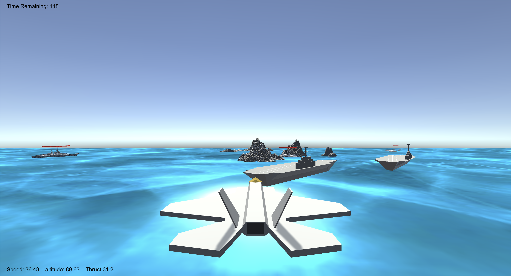

# Starflight

Starflight is a 3D Unity game, where you are in control of an F-35 combat aircraft and are tasked with defending a battleship from enemy bombers.

## About the Game

Bombers spawn from two enemy aircraft carriers, and fly towards the allied battleship, which is retreating from enemy territory. Once above the battleship, they drop their payload and fly away.

Your battleship has run out of ammunition and its systems have been jammed, so it is up to you to shoot down the enemy bombers as they approach the allied vessel.

It takes about 10 bombs to destroy your battleship, and each bomber can successfully drop anywhere from 1 to 3 bombs on the ship.

Your F-35 is not being directly attacked, but if you hit a bomber or the ocean, you lose.

## Controls

### Controller (HIGHLY Recommended) (Xbox Key Names)

- Left Thumbstick for controlling Pitch and Roll
- Right Trigger for controlling Thrust
- Hold A to fire Rockets

### Keyboard (NOT Recommended)

- Arrow keys for controlling Pitch and Roll
- Hold N to apply Thrust
- Hold Spacebar to fire Rockets
